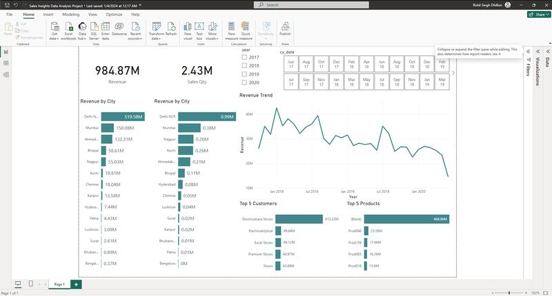

# Atliq Data Analysis Project

## Project Overview
This repository contains the Atliq Data Analysis project, an independent data analysis endeavor focused on enhancing the sales reporting capabilities of Atliq Hardware. The project involved a comprehensive analysis of over 150,000 real-world data entries from Atliq Hardware's MySQL sales database.

## Objectives
- To improve sales reporting processes for Atliq Hardware.
- To provide real-time sales insights and performance metrics through advanced data analysis.

## Tools and Technologies
- **MySQL**: Used for managing and querying the sales database.
- **Power BI**: Utilized for creating an interactive dashboard and report.
- **Power Query**: Employed in Power BI for the Extract, Transform, Load (ETL) process and data cleansing.
- **Star Schema**: Data modeling technique used for organizing the data effectively.

## Project Components
1. **Data Analysis and Modeling**
   - Analyzed sales data from Atliq Hardware's MySQL database.
   - Modeled the data into a star schema for efficient analysis and reporting.

2. **ETL and Data Cleansing**
   - Performed ETL operations using Power BI’s Power Query.
   - Cleansed and transformed the data for accuracy and usability.

3. **Dashboard Development**
   - Developed a comprehensive Power BI dashboard/report.
   - The dashboard provides insightful and real-time sales performance metrics.

## Usage
The Power BI dashboard can be accessed and utilized for monitoring sales trends, evaluating performance metrics, and making informed business decisions.

## Conclusion
This project showcases my ability to handle large datasets, apply effective data modeling techniques, and develop meaningful business intelligence tools. The result is a powerful dashboard that enhances the decision-making process for Atliq Hardware.

---
